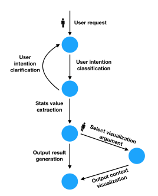

#  GameBot: A Visualization-augmented Chatbot for Sports Game [🔗](https://dl.acm.org/doi/pdf/10.1145/3334480.3382794)

**1. GameBot이 등장하게 된 이유** : NBA, EPL adopt conversational systems ~ (below specific)

📌 Why?
- deliver game information and engage fans.
- sports domain에서 chatbots are being used as a new outlet to connect and engage fans by offering quick and easy access to game stats and highlights.)

∴ So, present GameBot(interactive chatbot for sports fans to explore game statistical data.)

**2. 기존 GameBot과 해당 모델의 차이점**
- the direct answers to user’s stats-related questions
- the use of data visualizations

_💎GameBot에 사용되는 알고리즘💎 - natural language understanding(NLU) [🔗](https://ieeexplore.ieee.org/stamp/stamp.jsp?arnumber=9706456)_ 

**3. 논문 concepts** : Information visualization; Systems and tools for interaction design

**4. 기존 GameBot과 해당 모델의 차이점을 만들어내기 위한 노력**

  1. game statistical info이 불완전한 경향이 있음
  2. 이 gap 해결을 위해서 ’sports를 볼 때 고려하는 stats에 대한 이해’
  3. stats-related categories
     - (1) individual player stats
     - (2) team stats
     - (3) team performance record + sports media에서 널리 사용되는 visualization(such as a game flow chart and a shot chart in case users need more context for their questions) 

🛠️ 더 많은 맥락, 게임 통계 관련 질문을 이해하기 위해 gamebot을 visualization으로 통합.

참고: Reddit에서 데이터 들고 왔음 (석사 논문을 쓸 때 데이터를 Reddit에서 가져오는 것도 좋은 방법인 걸로 보임.)

**5. Architecture**

- Characterized fans’ comments into six themes
  - Player/team Appraisal
  - Game Observation
  - Personal Passion
  - Statistical Information
  - Game Decision maker
  - Peripheral Subjects

- summarized three major stats-related types
  - 1.Individual Player Stats
  - 2.Team Stats
  - 3.Team Season Record

- 해당 논문은 visualization에 중점을 두고 있고 6가지 option을 제공
  - 1. Data collection: 자동적으로 ESPN에서 최근 게임 스케쥴, stat data을 scrape.
  - 2. User intent classification: ‘Individual player stats, Team stats, and Team Season Record categories’와 사용자들의 request question을 match에서 search하기. (이걸 위해서 word-based cosine similarity을 사용. user questions ↔ every sentence in the question corpus. 한계점: 0.5)
      - 추가 공부할 점 : [word-based cosine similarity](https://studymachinelearning.com/cosine-similarity-text-similarity-metric/)
  - 3. Stats value extraction: word-by-word(문장, 구문을 단어 단위로 처리)로 원하는 stats type과 player, team value를 찾음. 
  - 4. Output result generation: 게임 결과에 대한 summary를 제공. 
  - 5. Visualization customization:  adopted and designed five visualizations and tables for each statsrelated category. 
  - 6. User interface

- back-end(for creating visualizations and communicates): javascript with D3.js + back-end(runs the data collection): Python 
